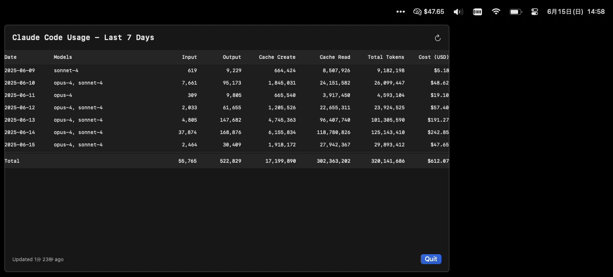

# ccusage-mac

  

Claude Codeの利用料金をリアルタイムでメニューバーに表示するmacOSアプリです。

[English](../README.md) | 日本語

## 概要

ccusage-macは[ccusage](https://github.com/ryoppippi/ccusage)にインスパイアされたmacOSメニューバーアプリケーションです。Claude Codeがローカルに保存する利用データを読み取り、本日の料金をメニューバーに表示します。5分ごとに自動更新されます。

## 主な機能

- 📊 **リアルタイム料金表示**: メニューバーに本日の利用料金を表示
- 📅 **週間利用状況**: 過去7日間の利用状況を表形式で確認
- 🔄 **自動更新**: 5分ごとに自動的に最新データを取得
- 📈 **詳細な内訳**: トークン使用量の詳細を確認可能
- 🧠 **モデル別追跡**: 使用したClaudeモデル（Opus、Sonnet等）を表示
- 🔒 **プライバシー重視**: 外部サーバーへの通信は一切なし

## プライバシーとセキュリティ

**このアプリは完全にローカルで動作します：**
- ネットワーク通信は一切行いません
- APIキーは不要です
- Claude Codeが`~/.claude/projects/`に保存するJSONLファイルを読み取るだけです
- 個人情報や利用データが外部に送信されることはありません

## 料金計算の仕組み

アプリは以下の手順で料金を計算します：

1. **データソース**: Claude Codeが自動的に生成する`~/.claude/projects/*/api_conversations/*.jsonl`ファイルを読み取ります
2. **料金計算**: Anthropic公式の料金体系に基づいて計算：
   - **Opus 4**: $15/MTok (入力), $75/MTok (出力)
   - **Sonnet 4**: $3/MTok (入力), $15/MTok (出力)  
   - **Haiku 3.5**: $0.80/MTok (入力), $4/MTok (出力)
3. **重複除外**: messageIdとrequestIdのハッシュを使用して重複を除外
4. **日付フィルタリング**: ローカルタイムゾーンで日付を判定

## 必要な環境

- macOS 13.0 (Ventura) 以降
- Claude Codeがインストールされ、利用データが存在すること

## インストール方法

### GitHubリリースからダウンロード（推奨）

1. [Releases](https://github.com/ssss-yajima/ccusage-mac/releases)ページにアクセス
2. 最新の`.dmg`ファイルをダウンロード
3. DMGをダブルクリックして、CCUsageMacをApplicationsフォルダにドラッグ
4. ApplicationsフォルダからCCUsageMacを起動

**重要なセキュリティ情報**: 
- 初回起動時、アプリがNotarizeされていないため、macOSがセキュリティ警告を表示します
- アプリを右クリック（またはControlキー+クリック）して、コンテキストメニューから「開く」を選択
- 表示されるダイアログで「開く」をクリック
- または、システム設定 > プライバシーとセキュリティで「このまま開く」をクリック
- この操作は初回起動時のみ必要です

### ログイン時に自動起動

CCUsageMacをログイン時に自動的に起動するには：
1. システム設定 > 一般 > ログイン項目を開く
2. +ボタンをクリックしてCCUsageMacを追加

## 使い方

1. アプリを起動すると、メニューバーに脳アイコン（🧠）と本日の料金が表示されます
2. アイコンをクリックすると、過去7日間の詳細情報が表示されます：
   - 日付別の料金
   - トークン使用量の内訳（入力/出力/キャッシュ）
   - 使用したモデル
   - 最終更新時刻
3. 「Refresh」ボタンで手動更新
4. 「Quit」でアプリを終了

## 既知の制限事項

- ccusageとわずかに計算結果が異なる場合があります（タイミングの違いによる）
- Claude Codeがインストールされ、利用データが存在する必要があります

## ライセンス

MIT License - 詳細は[LICENSE](../LICENSE)ファイルを参照

## 謝辞

- [ccusage](https://github.com/ryoppippi/ccusage) - このプロジェクトのインスピレーション元となったCLIツール
- [Anthropic](https://www.anthropic.com) - ClaudeとClaude Codeの開発元

## 関連プロジェクト

- [ccusage](https://github.com/ryoppippi/ccusage) - より多機能なCLI版
- [Claude Code](https://claude.ai/code) - AIコーディングアシスタント