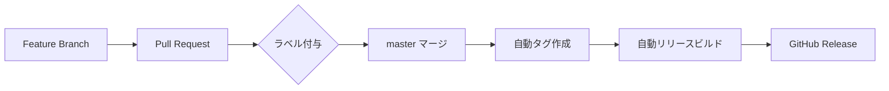

# CI/CD ガイド

## 概要

CCUsageMacプロジェクトでは、GitHub Actionsを使用した自動リリースシステムを採用しています。PRのラベルに基づいて自動的にバージョニング、タグ付け、リリースビルドが行われます。

## リリースフロー

### 1. 開発フロー



### 2. ラベルによるバージョニング

PRに以下のラベルを付けることで、自動的にバージョンが決定されます：

| ラベル | バージョン変更 | 例 | 使用場面 |
|--------|--------------|-----|----------|
| `release:major` | メジャーバージョンアップ | 1.2.3 → 2.0.0 | 破壊的変更、大幅な仕様変更 |
| `release:minor` | マイナーバージョンアップ | 1.2.3 → 1.3.0 | 新機能追加、機能拡張 |
| `release:patch` | パッチバージョンアップ | 1.2.3 → 1.2.4 | バグ修正、小さな改善 |
| `release:skip` | リリースなし | - | リリース不要な変更 |

### 3. PR分類ラベル

リリースノートの自動生成のために、PRの内容を分類するラベルも使用します：

- `breaking-change` - 破壊的変更
- `feature` - 新機能
- `enhancement` - 既存機能の改善
- `bug` / `fix` - バグ修正
- `documentation` - ドキュメント変更
- `ci` - CI/CD関連の変更

## セットアップ

### 1. ラベルの作成

リポジトリに必要なラベルを作成します：

```bash
# リポジトリのルートディレクトリで実行
bash .github/setup-labels.sh
```

### 2. リポジトリ設定

1. **Settings > Actions > General** で以下を確認：
   - "Allow GitHub Actions to create and approve pull requests" を有効化
   - Workflow permissions を "Read and write permissions" に設定

2. **Settings > Branches** でmasterブランチの保護ルールを設定（推奨）：
   - Require pull request reviews before merging
   - Dismiss stale pull request approvals when new commits are pushed
   - Require status checks to pass before merging

## 使用方法

### 1. PR作成時

```bash
# feature ブランチで作業
git checkout -b feature/new-feature
# ... 変更を加える ...
git add .
git commit -m "Add new feature"
git push origin feature/new-feature
```

### 2. PR にラベルを付ける

GitHub UI または CLI でラベルを付与：

```bash
# GitHub CLI を使用する場合
gh pr create --title "Add new feature" --label "release:minor" --label "feature"
```

### 3. マージ後の自動処理

1. PRがmasterにマージされると、`prepare-release.yml` が起動
2. ラベルに基づいて新しいバージョンを計算
3. 新しいタグを作成してプッシュ
4. タグプッシュにより `release.yml` が起動
5. アプリをビルドし、DMGを作成
6. GitHub Releaseを作成し、DMGを添付

## ワークフロー詳細

### prepare-release.yml

- **トリガー**: PRのmasterへのマージ
- **処理内容**:
  - PRラベルの確認
  - バージョン計算
  - タグ作成
  - PRへのコメント追加

### release.yml

- **トリガー**: `v*` タグのプッシュ
- **処理内容**:
  - macOSでのビルド
  - アプリバンドル作成
  - コード署名
  - DMG作成
  - リリースノート生成
  - GitHub Release作成

## トラブルシューティング

### ラベルが認識されない

- PRに正しいラベルが付いているか確認
- `release:` プレフィックスが正しく付いているか確認

### タグが作成されない

- GitHub Actionsの権限を確認
- ワークフローログでエラーを確認

### ビルドが失敗する

- Swift バージョンの互換性を確認
- 依存関係の問題を確認
- macOS のバージョン要件を確認

## ベストプラクティス

1. **明確なPRタイトル**: リリースノートに含まれるため、わかりやすいタイトルを付ける
2. **適切なラベル付け**: バージョニングとカテゴリーの両方のラベルを付ける
3. **Breaking Changesの明記**: 破壊的変更がある場合は必ず `breaking-change` ラベルを付ける
4. **小さなPR**: レビューしやすく、問題の特定が容易
5. **テストの実行**: マージ前に必ずテストを実行

## 今後の拡張案

- Conventional Commits の導入
- 自動CHANGELOG生成
- プレリリース（beta/rc）サポート
- 複数プラットフォーム対応